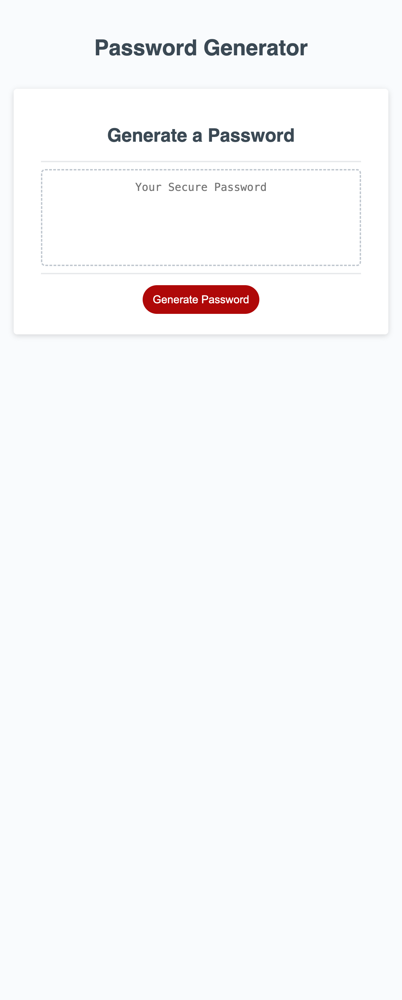

# generate-a-password

## Description 

This is my password generator repository. I modified the existing code to build a successful password generator. by doing this excercise, i was able to learn more about event listeners, math.random, and character sets in javaScript. i was even able to get a real, working password generator out of it, how cool! 

## Usage

to use the website and generate your own password, click this link: 

https://landonjett.github.io/generate-a-password/

you can also view this screen shot of the website for your reference. 

## Credits

https://coding-boot-camp.github.io/full-stack/github/professional-readme-guide
https://developer.mozilla.org/en-US/docs/Web/JavaScript/Reference/Global_Objects/Math/random
https://developer.mozilla.org/en-US/docs/Web/JavaScript/Reference/Statements/return
https://developer.mozilla.org/en-US/docs/Web/JavaScript/Data_structures
https://developer.mozilla.org/en-US/docs/Web/JavaScript/Reference/Global_Objects/Function